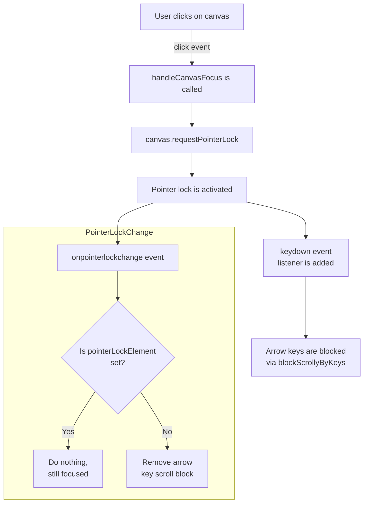

## Custom Focus Mode Behavior

When the canvas is clicked, the browser enters the custom focus mode via the Pointer Lock API.

In focus mode:

- The mouse cursor is hidden and locked to the canvas.
- Mouse movement speed (`movementX`, `movementY`) is still captured, allowing for interaction even though the cursor doesn't move visibly.
- Arrow keys (← ↑ ↓ →) are disabled for scrolling, preventing unwanted page movement during interaction.

When the user exits focus (e.g., by pressing Esc), the pointer lock is released, arrow key scrolling is restored, and visual indicators (like the canvas border) are reset.

## Flow chart

## Disclaimer
This logic shouldn't work in mobile browsers as the pointer lock api is not
present there (if I'm right), if you implement this remember to check on the user agents to 
avoid triggering the focus mode in mobile.